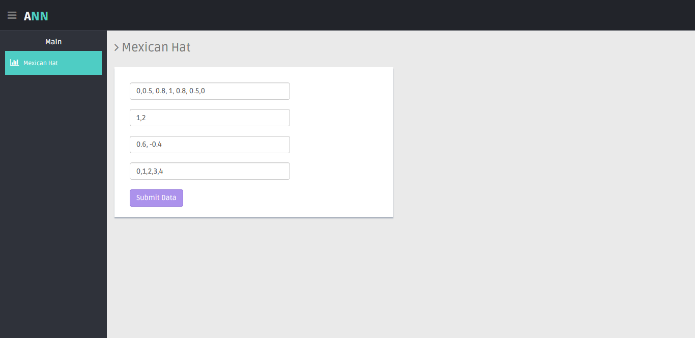
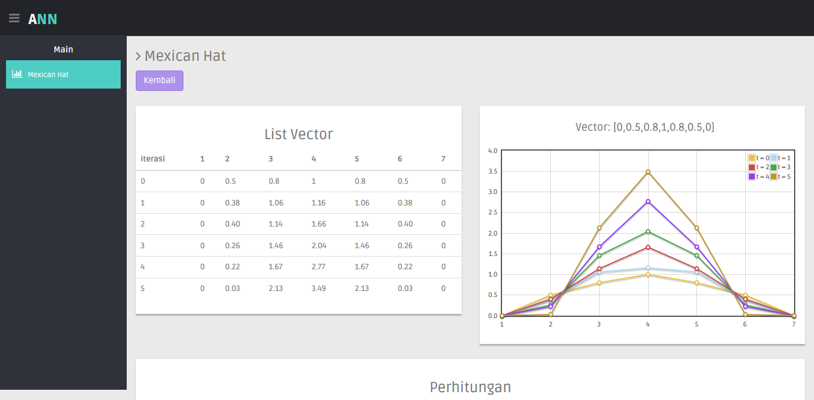
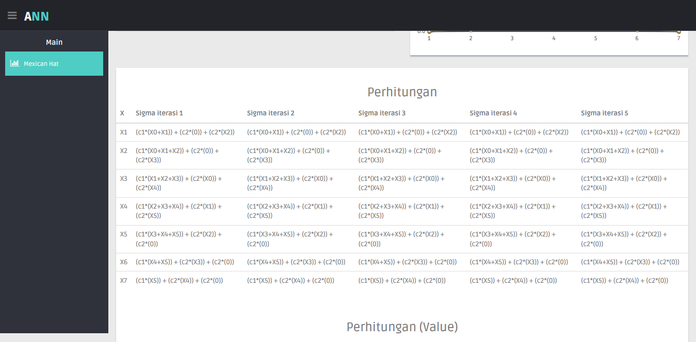
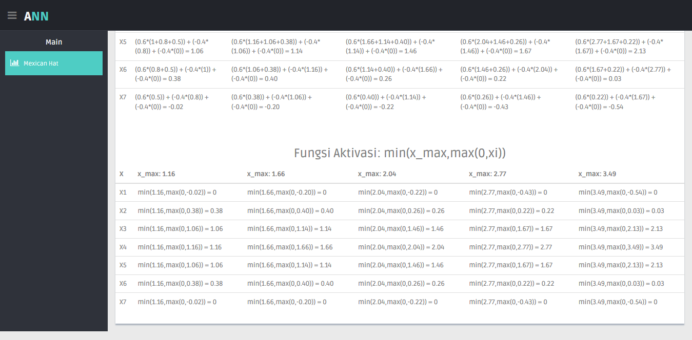

# Mexican Hat

Neural network based on competition with fixed weight. This repository is archived from the 6th-semester final project on the artificial neural network course, Sriwijaya University.

## Team members:

* Dian Palupi Rini (Lecturer) - [Scholar](https://scholar.google.com/citations?user=e7uhEJMAAAAJ&hl=en)
* Riska Wati Savitri - [LinkedIn](https://www.linkedin.com/in/riska-wati-savitri-785104198/), [Instagram](https://www.instagram.com/savitri59/)
* Maharani Putri Rama - [Instagram](https://www.instagram.com/maharaniputriramaa/)
* Atan Wicaksana Ramadhanti - [LinkedIn](https://www.linkedin.com/in/atan-w-ramadhanti-845936188/), [Instagram](https://www.instagram.com/atanwrawr/)
* Muhammad Irfan Triananto Putra - [LinkedIn](https://www.linkedin.com/in/trianantoputra/)


## Getting Started

These instructions will get you a copy of the project up and running on your local machine for development and testing purposes. The system is made with [CodeIgniter](https://codeigniter.com/)

### Prerequisites

What things you need to install the software

* Local server - [XAMPP](https://www.apachefriends.org/index.html), etc.
* Browser - [Google Chrome](https://www.google.com/chrome/), [Firefox](https://www.mozilla.org/en-US/firefox/new/), etc.

### Running the tests

* open XAMPP, run Apache.
* open url in the browser "localhost/{folder name}" (or 127.0.0.1), use **one** of the following:
```
localhost/hat

localhost:8080/hat // if manually used port 8080

127.0.0.1/hat
```

### Input

input: 
#### **vector**
* the vector must be palindrome (same wether it's read from backward or forward)
* the input must be comma separated

```
0, 0.5, 0.8, 1, 0.8, 0.5, 0
```

#### **radius**
* there must be 2 constant value for radius
* the input must be comma separated

```
1, 2
```

#### **constant**
* there must be 2 constant value for constant parameter
* the first constant must be positive (number > 0)
* the second constant must be negative (number < 0)
* the input must be comma separated

```
0.6, -0.4
```

#### **T_max**
* the input must start from zero (this feature still not updated yet!)
* the number in the input is the number iteration in mexican hat neural network
* the input must be comma separated

```
0, 1, 2, 3, 4
```

<p align="center">
  
</p>

### Output

the systems will give the following outputs:
* List vectors
* Graph of the output vectors
* The formula for manual calculations
* The value for manual calculations
* List new vectors (from activation function)


#### List vectors & graph of the output vectors
<p align="center">
  
</p>

#### The formula for manual calculations
<p align="center">
  
</p>

#### The value for manual calculations
<p align="center">
  
</p>

#### List new vectors (from activation function)
<p align="center">
  
</p>

## Reference
* Jaringan Kompetisi, [Dian Palupi Rini, 2019](https://github.com/trianantoputra/hat/blob/master/Maxnett-Hamming-Mexican%20Hat.pdf)